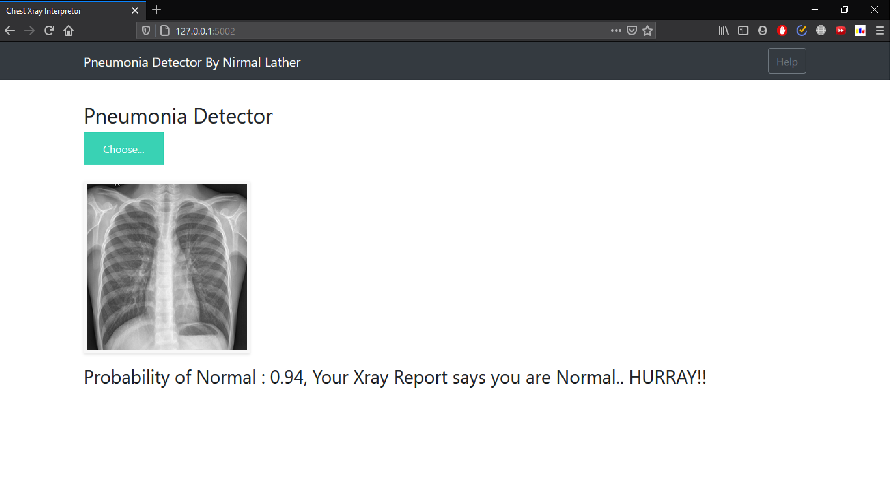
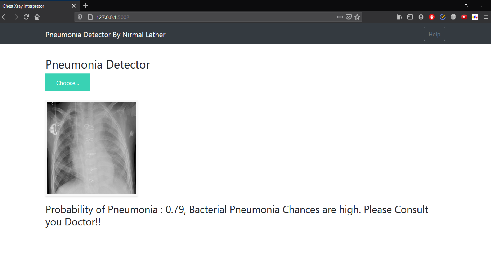
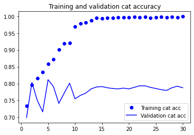

# Pneumonia Detector

## About

This end-to-end project consists of a web application which uses Deep Learning algorithms to detect Pneumonia. User will upload a photo of chest x-ray and get his results within seconds. This is an easy to use application and can be deployed to production.


## Screenshots

Here are some screenshots of the demo application :






## Built with

* **Keras** for modeling neural networks
* **Flask** micro framework for the web application
* **HTML & JS** for front end application
* **Google's TPU** for training models

## Approach towards the solution

### Step one : Collecting the data

* Finding right data is crucial to success of any good algorithm. For this reason I spend around a day researching finding all available datasets on kaggle and google. I decided to go with the [NIH Dataset](https://www.kaggle.com/nih-chest-xrays). I made a subset of that dataset containing Pneumonia cases only for my project.

*To remove data imabalance *Data Augmentation* was very helpful in this case. Data Augmentation is a technique where we produce images of undersampled classes to balance the overall distribution. I used *imgaug* library for this purpose.


### Step two : Modelling the Neural Networks

* As this is a Computer Vision problem, using *Convolutional Neural Networks* was a no-brainer.
* I've used *transfer learning* with the *MobileNet* model as I did not have resources to train model from scratch.
* But I used only partial transfer learning, i.e. I initialized a percentage of initial layers with the Imagenet weights and the rest of the layers were trained from scratch. This is because the first few layers capture general details like edges, patches etc. and instead of randomized weights this would give lesser training time and higher accuracy. The last layers are trained from scratch since they capture the finer details which are important in medical imagery.
* I've used Adam Optimizer with learning rate of "0.0001" with "1e-5" decay for the model, although I experimented a lot with the hyper parameters.
* Experimented with [Early Stopping](https://en.wikipedia.org/wiki/Early_stopping) to prevent over-fitting.
* Here are some results with experimenting with differnt Neural Nets -

| Model | Number of Epochs | Training Accuracy | Validation Accuracy |
| :---: | :---: | :---: | :---: |
| Mobilenet | 20 | 0.95 | 0.71 |
| Mobilenet | 30 | 0.99 | 0.79 |


* A graph of accuracy for training vs validation for the Mobile net -



### Step three : Training the models

*I figured out how to use Google's experimental [TPU](https://cloud.google.com/tpu/) aka Tensor Processing Unit to train my model. This cut down my training time to around 2 hours! This is a lightning fast tech by Google and I recommend anyone to try it. It involves a lot of over-head though as we need to convert Keras model to a model usable by TPU and then convert it back to Tensorflow/Keras model which can be used to make inferences in Flask.

### Step four : Building Webpage

* This honestly took a major chunk of my time (around 3 days) to execute since I had no knowledge of Javascript, HTML, RESTful APIs and web frameworks. But it was worth investing time in as I now can create Proof Of Concepts for my future projects and showcase them to my friends and enthusiasts.
* I used Flask framework primarily because it is Python-based, which I already am fluent in, and extremely easy to learn and deploy. There are tons of resources available to use Flask and I've attached links to the ones which helped me the most.


## Useful resources

* *Deep Learning for abnormality detection in Chest X-Ray images* research paper by Christine Tataru, Archana Shenoyas, Darvin Yi and Anthony Ma - [link](http://cs231n.stanford.edu/reports/2017/pdfs/527.pdf)
* *Bharat Raj's* medium article on Data Augmentation - [link](https://medium.com/nanonets/how-to-use-deep-learning-when-you-have-limited-data-part-2-data-augmentation-c26971dc8ced)
* *Andrew NG's* video lecture on transfer learning - [link](https://www.youtube.com/watch?v=yofjFQddwHE)
* *Deeplizard's* youtube series on using Flask to deploy Keras models - [link](https://www.youtube.com/watch?v=SI1hVGvbbZ4)

## Running the app

#### Prerequisites :
* Jupyter Notebooks
* Python
* Tensorflow
* Keras
* Flask
* (optional) Google Colab account for Training

#### Step 1 : download the dataset
You can download the dataset from this [link](https://www.kaggle.com/paultimothymooney/chest-xray-pneumonia)

#### Step 2 : train the model
You can find set of Jupyter Notebooks "/notebooks" folder. Note that these notebooks are designed to be run in Google Colab. You will have to upload the dataset into your Google Drive and then mount the drive into your Colab notebook.

#### Step 3 : copy the h5 file
Copy the downloaded "model.h5" Hierarchical Data Format file which contains the model architecture and weights and place it in the "Deployment/models" folder. Make sure that you rename the file to "vgg_tuned.h5" as the 

#### Step 4 : start the flask server
Navigate to the "Deployment" directory and execute the following commands in the terminal
```
python app.py
```
This will start the server.

#### Step 5 : use the application
Open your browser and enter the following address : localhost:5002
Now you can use the application.
